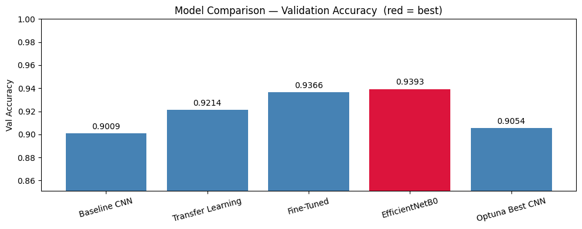

# NeuroScan — Brain Tumor Classification

> End-to-end MRI brain tumor classification pipeline with Transfer Learning, Hyperparameter Optimization, ONNX Quantization, Explainable AI (Grad-CAM), MLflow experiment tracking, and a FastAPI + HTML/CSS web interface. Fully Dockerized and deployable to HuggingFace Spaces.


---

## Results

| Model | Val Accuracy | Notes |
|---|---|---|
| Baseline CNN | 90.09% | 3-layer custom CNN |
| Transfer Learning (MobileNetV2) | 92.14% | Frozen ImageNet weights |
| Fine-Tuned (MobileNetV2) | 93.66% | Last 20 layers unfrozen |
| **EfficientNetB0** | **93.93%** | **Best model** |
| Optuna-Tuned CNN | 90.54% | 10-trial hyperparameter search |



### ONNX Quantization

| Format | Size | Latency | Notes |
|---|---|---|---|
| TF FP32 | ~20 MB | baseline | Full precision |
| ONNX FP32 | ~20 MB | ~1.2x faster | Optimised graph |
| ONNX Dynamic INT8 | ~5 MB | ~1.5x faster | MatMul/Gemm layers only |
| ONNX Static INT8 | ~5 MB | ~2-3x faster | Calibrated, best for prod |

---

## Project Structure

```
NeuroScan/
│
├── app.py                   # FastAPI entry point (renamed from main.py)
├── train.py                 # full training pipeline + MLflow logging
├── evaluate.py              # confusion matrix + classification report
├── predict.py               # unified inference (TF + all ONNX backends)
├── save_model.py            # save best model + Grad-CAM artifacts
├── config.yaml              # all hyperparameters and paths (no secrets)
├── requirements.txt         # pinned dependencies
├── Dockerfile               # Docker deployment
├── .env.example             # template for credentials
├── README.md
│
├── src/                     # core library modules
│   ├── __init__.py
│   ├── data_loader.py       # dataset loading + augmentation
│   ├── models.py            # all 5 model architectures
│   ├── utils.py             # logger, Grad-CAM, plotting helpers
│   └── export_onnx.py       # TF -> ONNX + Dynamic INT8 + Static INT8
│
├── static/
│   └── index.html           # HTML/CSS/JS frontend UI
│
├── saved_models/            # trained model files (via Git LFS)
│   ├── ft_best.h5
│   └── model_metadata.json
│
├── onnx_models/             # ONNX model files (via Git LFS)
│   ├── model_fp32.onnx
│   ├── model_dynamic_int8.onnx
│   ├── model_static_int8.onnx
│   └── benchmark_results.json
│
├── logs/
│   ├── model_comparison.png
│   └── *.log
│
└── data/                    # NOT in Git — download separately
    ├── Training/
    │   ├── glioma/
    │   ├── meningioma/
    │   ├── notumor/
    │   └── pituitary/
    └── Testing/
```

---

## Dataset

**Brain Tumor MRI Dataset** — [Kaggle](https://www.kaggle.com/datasets/masoudnickparvar/brain-tumor-mri-dataset)

| Split | Images |
|---|---|
| Training | 5,600 |
| Validation | 1,120 (20% of training) |
| Testing | 1,600 |

Classes: `glioma`, `meningioma`, `notumor`, `pituitary`

---

## Setup

### 1. Clone the repository

```bash
git clone https://github.com/Shoaib-33/NeuroScan-.git
cd NeuroScan-
```

### 2. Create environment

```bash
conda create -n brain_tumor python=3.10 -y
conda activate brain_tumor
conda install -c conda-forge cudatoolkit=11.2 cudnn=8.1 -y
pip install -r requirements.txt
```

### 3. Download dataset

```bash
# Place kaggle.json at ~/.kaggle/kaggle.json first
# Download from: kaggle.com -> Account -> API -> Create New Token

kaggle datasets download -d masoudnickparvar/brain-tumor-mri-dataset
mkdir data
tar -xf brain-tumor-mri-dataset.zip -C data
```

### 4. Set up credentials

```bash
# Copy the template
cp .env.example .env

# Edit .env and fill in your real values
# DAGSHUB_USERNAME=your_username
# DAGSHUB_TOKEN=your_token
```

Get your DagsHub token at: **dagshub.com → Avatar → User Settings → Tokens → Generate New Token**

---

## Run Order

```bash
# Step 1 — Train all models (logs live to DagsHub)
python train.py

# Step 2 — Evaluate best model on test set
python evaluate.py

# Step 3 — Export to ONNX + quantize
python src/export_onnx.py

# Step 4 — Start API server
python app.py

# Step 5 — Open browser at http://localhost:8000
```

---

## Docker

### Build and run locally

```bash
docker build -t neuroscan .
docker run -p 8000:8000 \
  -e DAGSHUB_USERNAME=your_username \
  -e DAGSHUB_TOKEN=your_token \
  neuroscan
```

### Using docker-compose (optional)

```yaml
# docker-compose.yml
version: "3.9"
services:
  neuroscan:
    build: .
    ports:
      - "8000:8000"
    environment:
      - DAGSHUB_USERNAME=${DAGSHUB_USERNAME}
      - DAGSHUB_TOKEN=${DAGSHUB_TOKEN}
    volumes:
      - ./data:/app/data
```

```bash
docker-compose up
```

---

## HuggingFace Spaces Deployment

```bash
# Install Git LFS (required for model files)
git lfs install
git lfs track "*.h5"
git lfs track "*.onnx"

# Push to HuggingFace Space
git remote add space https://huggingface.co/spaces/YOUR_HF_USERNAME/neuroscan
git push space main
```

Set secrets in HF Space: **Settings → Variables and secrets**
```
DAGSHUB_USERNAME = your_username
DAGSHUB_TOKEN    = your_token
```

---

## API Endpoints

Base URL: `http://localhost:8000`

| Method | Endpoint | Description |
|---|---|---|
| GET | `/health` | Health check + loaded backends |
| GET | `/models/info` | Model metadata + all results |
| GET | `/benchmark` | ONNX quantization benchmark |
| POST | `/predict` | TensorFlow FP32 prediction |
| POST | `/predict/onnx` | ONNX FP32 prediction |
| POST | `/predict/dynamic` | Dynamic INT8 prediction |
| POST | `/predict/static` | Static INT8 prediction |
| POST | `/predict/gradcam` | TF prediction + Grad-CAM heatmap |

### Example request

```bash
curl -X POST http://localhost:8000/predict/gradcam \
  -F "file=@path/to/mri_image.jpg"
```

### Example response

```json
{
  "predicted_class": "glioma",
  "confidence": 96.43,
  "all_probabilities": {
    "glioma": 96.43,
    "meningioma": 2.11,
    "notumor": 0.98,
    "pituitary": 0.48
  },
  "backend": "tensorflow",
  "latency_ms": 42.5,
  "gradcam_b64": "<base64 PNG>",
  "heatmap_b64": "<base64 PNG>"
}
```

---

## CLI Prediction

```bash
# TF backend (default)
python predict.py --image data/Testing/glioma/Te-gl_0010.jpg

# ONNX Static INT8
python predict.py --image data/Testing/glioma/Te-gl_0010.jpg --backend onnx_static

# With Grad-CAM overlay (TF only)
python predict.py --image data/Testing/glioma/Te-gl_0010.jpg --gradcam
```

---

## Models

### Baseline CNN
Custom 3-layer convolutional network trained from scratch. Serves as the performance baseline. No pretrained weights.

### MobileNetV2 Transfer Learning
Pre-trained on ImageNet with frozen base. Only the classification head (GAP → Dense 128 → Softmax) is trained. Fast convergence with limited medical data.

### MobileNetV2 Fine-Tuned
Last 20 layers unfrozen and retrained with learning rate 1e-5. Adapts ImageNet features to brain MRI domain for improved accuracy.

### EfficientNetB0 — Best Model (93.93%)
Compound scaling of depth, width, and resolution gives it stronger feature extraction than MobileNetV2 at similar size. Frozen base with custom head. Uses `WeightsCheckpoint` callback to avoid TF 2.10 EagerTensor serialization bug.

### Optuna-Tuned CNN
10-trial automated search over filter counts `[32,64]`→`[64,128]`→`[128,256]`, dense units `[64,128,256]`, dropout `[0.2–0.5]`, and learning rate `[1e-4–1e-2]`. Each trial logged as a nested MLflow run on DagsHub.

---

## Explainable AI — Grad-CAM

Grad-CAM (Gradient-weighted Class Activation Mapping) highlights the MRI regions the model focused on.

**Pipeline:**
1. Forward pass to last Conv2D layer
2. Compute gradients of predicted class score w.r.t conv output
3. Global average pool gradients to get per-channel weights
4. Weighted sum of feature maps → heatmap
5. Resize and overlay on original image with JET colormap

Warmer colors (red/yellow) = higher attention. For a trustworthy medical model, these should overlap with the tumor region, not background tissue.

---

## MLflow + DagsHub Tracking

View live experiments: [DagsHub Experiment Tracker](https://dagshub.com/shoaib.shahriar01/brain-tumor-classification.mlflow)

Each run logs:
- All hyperparameters
- Per-epoch train/val accuracy and loss (interactive graphs)
- Best validation accuracy and loss
- Saved model artifacts
- Grad-CAM heatmap images per class

Optuna trials are logged as **nested child runs** under `Optuna_Search_Parent` — compare all 10 trial curves side by side on DagsHub.

---

## Credentials — Security

This project uses environment variables for all secrets. `config.yaml` contains **zero credentials** and is safe to commit.

| Location | How to set credentials |
|---|---|
| Local development | Create `.env` file (see `.env.example`) |
| Docker | Pass `-e DAGSHUB_USERNAME=... -e DAGSHUB_TOKEN=...` |
| HuggingFace Spaces | Space Settings → Variables and secrets |
| GitHub Actions | Repository Settings → Secrets |

```bash
# .env (never committed — listed in .gitignore)
DAGSHUB_USERNAME=your_username
DAGSHUB_TOKEN=your_token
```

---

## Data Augmentation

Applied to training set only:

| Technique | Value |
|---|---|
| Rotation | ±15° |
| Width shift | ±10% |
| Height shift | ±10% |
| Zoom | ±10% |
| Horizontal flip | Yes |
| Brightness | 0.9 – 1.1× |

---

## Known Issues & Fixes

| Issue | Fix |
|---|---|
| EfficientNetB0 `ModelCheckpoint` EagerTensor crash (TF 2.10) | Custom `WeightsCheckpoint` using `save_weights()` |
| `mlflow.keras.log_model` crashes for EfficientNetB0 | Weights logged as plain artifact via `mlflow.log_artifact()` |
| `ConvInteger` op not supported in ORT CPU for MobileNetV2 | Dynamic quantization uses `op_types_to_quantize=["MatMul","Gemm"]` only |
| Windows cp1252 encoding error for Unicode characters | `encoding='utf-8'` on `FileHandler`; ASCII used in log strings |
| NumPy 2.x incompatible with TF 2.10 | Pinned to `numpy==1.24.3` |
| protobuf conflicts between TF and MLflow | Pinned to `protobuf==3.20.3` + env var `PROTOCOL_BUFFERS_PYTHON_IMPLEMENTATION=python` |

---

## Hardware

| Component | Spec |
|---|---|
| GPU | NVIDIA RTX 3050 |
| VRAM | 4 GB |
| RAM | 16 GB |
| OS | Windows 11 |
| CUDA | 11.2 |
| cuDNN | 8.1 |

**Training time on RTX 3050:**

| Stage | Time |
|---|---|
| Baseline CNN (20 epochs) | ~10 min |
| Transfer Learning (20 epochs) | ~8 min |
| Fine-Tuning (20 epochs) | ~20 min |
| EfficientNetB0 (20 epochs) | ~15 min |
| Optuna (10 trials × 10 epochs) | ~20 min |
| **Total** | **~75 min** |

---

## License

MIT License — free to use for educational and research purposes.

---

## Author

**Md Shoaib Shahriar Ibrahim**
- GitHub: [Shoaib-33](https://github.com/Shoaib-33)
- DagsHub: [shoaib.shahriar01](https://dagshub.com/shoaib.shahriar01)
- Experiment Tracking: [View on DagsHub](https://dagshub.com/shoaib.shahriar01/brain-tumor-classification.mlflow)

---

> **Disclaimer:** This project is for educational and research purposes only. It is not intended for clinical diagnosis or medical use.
